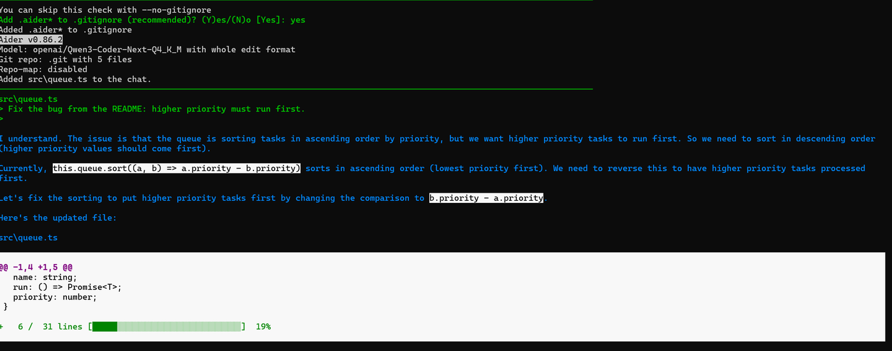

<p align="center"></p>

# Coachwhip

**Run mixture-of-experts models that are bigger than your memory.**

An 80B model, running comfortably on a 16 GB Mac; a 122B model too, after a five-minute squeeze. Coachwhip never needs the whole model in memory, because a mixture-of-experts model never needs the whole model for one word.

One Rust binary. Everything on the GPU. Nothing leaves your machine.

**New in 0.3.0** ([release notes](https://github.com/1picassoai/coachwhip/releases/tag/v0.3.0)): the 80B writes about a quarter faster, from the early guess and a recommended Q3_K_M file; Qwen3.6-35B-A3B, Qwen's newest MoE generation, runs, with a thinking switch; a models page with measured speed and a quality check per file: [docs/MODELS.md](docs/MODELS.md).

**Tried it? Tell us how it ran**, good or bad, especially if it was slow, the fan worked hard, or it ran hot. [Open an issue](https://github.com/1picassoai/coachwhip/issues) with your Mac (chip and memory), macOS version, the model file, the `--bank` you used, and the speed line the chat page shows under each answer. Questions and ideas are welcome there too.

<p align="center"></p>

## Why it works

A mixture-of-experts (MoE) model is made of many small experts, and a router picks only a few of them for each word. Qwen3-Coder-Next has 80 billion parameters, but each word wakes up only about 3 billion of them.

Coachwhip is built around that fact:

- **Streams experts, not files.** The small, always-used part of the model lives on the GPU. The experts stay on the SSD, and for each word Coachwhip reads exactly the experts the router picked.
- **An expert bank on the GPU.** Recently used experts stay in a bank in the GPU's memory and are reused, so the SSD is only touched for experts the bank does not hold.
- **The early guess.** While the GPU works on one layer, Coachwhip runs the router of a layer four steps ahead on the same input, so it already knows most of the experts that layer will want, and reads them in while the GPU is busy. A guess that would land too late is dropped rather than evicting an expert still in use. The last few layers, which have no later router, use the routes the model has taken before, and every chat teaches that table more.
- **One GPU dispatch per layer.** All the experts a layer picked run together in a single fused kernel.
- **Reads while it computes.** When a prompt needs more experts than the bank holds, the GPU starts on each expert the moment its bytes land, while the rest are still being read.
- **Unified memory, used properly.** On Apple silicon the CPU and GPU share one memory, so an expert read from the SSD lands straight where the GPU reads it. No copies.

## Numbers

Mac mini M4, 16 GB, both models at Q4_K_M.

| | Qwen3-Coder-30B-A3B | Qwen3-Coder-Next (80B) |
|---|---|---|
| Model file | 18.6 GB | 48.4 GB |
| Follow-up in a chat | reads only your new words | reads only your new words |

While it reads your prompt, the page shows the layer it is on, from the first second.

## What it does to your Mac

Honest numbers, so you can decide.

| | 30B on 16 GB (bank 44) | 80B on 16 GB (bank 56) |
|---|---|---|
| Held by Coachwhip while the model is hot | about 11 GB | about 7.5 GB |
| Left for everything else | about 3 GB | about 7 GB |

The 30B's experts are bigger than the 80B's, so it holds more. If memory runs short, macOS squeezes your other apps, not Coachwhip. If the GPU runs out of room, Coachwhip says so on the page and stops; close some apps, or start it again with a smaller `--bank`.

With 24 GB or more the 80B runs with room to spare. `--bank` trades GPU memory for speed in either direction; on 16 GB, 56 is the most the 80B should use.

## Models

Coachwhip is an engine for MoE models, in GGUF format.

| Model | Architecture | Status |
|---|---|---|
| [Qwen3-Coder-30B-A3B-Instruct](https://huggingface.co/Qwen/Qwen3-Coder-30B-A3B-Instruct) | qwen3moe | Tested. |
| [Qwen3-Coder-Next](https://huggingface.co/Qwen/Qwen3-Coder-Next) (80B) | qwen3next | Tested. See below for the file to use. |
| [Qwen3-Next-80B-A3B-Instruct](https://huggingface.co/Qwen/Qwen3-Next-80B-A3B-Instruct) | qwen3next | Tested. |
| [Qwen3.6-35B-A3B](https://huggingface.co/Qwen/Qwen3.6-35B-A3B) | qwen35moe | Tested. Thinks when asked to. |
| [Qwen3.5-122B-A10B](https://huggingface.co/Qwen/Qwen3.5-122B-A10B) | qwen35moe | Tested, after `prepare` (see The 122B). |
| Qwen3-30B-A3B, other Qwen3 MoE | qwen3moe | Supported. |
| Qwen3.5 MoE, Qwen3.6-14B-A3B (community) | qwen35moe | Supported. The 14B fits in 16 GB on its own; Coachwhip does not make it faster. |
| Mixtral, Qwen2-MoE, OLMoE, DeepSeek, gpt-oss, GLM | | Coming next. |

Speed and a quality check for each model file, measured on a 16 GB Mac: [docs/MODELS.md](docs/MODELS.md).

Try other MoE models and tell us what happens. If a model's architecture is not supported yet, Coachwhip says so, and an issue is the fastest way to move it up the list.

**Which GGUF file.** Coachwhip reads the standard GGUF quantisations (Q3_K, Q4_K, Q5_K, Q6_K, Q8_0, F16). Some newer conversions store a few tensors in MXFP4 or fuse the attention weights into one tensor; Coachwhip does not read those yet. For Qwen3-Coder-Next, [MaziyarPanahi's Q3_K_M and Q4_K_M](https://huggingface.co/MaziyarPanahi/Qwen3-Coder-Next-GGUF) load as is.

## What you need

| | 30B | 80B | 122B |
|---|---|---|---|
| Mac | Apple silicon, M4 or later recommended; M1 to M3 run it slower. Tested on a Mac mini M4. | the same | the same |
| Memory | 16 GB | 16 GB; 24 GB has room to spare | 16 GB |
| Disk | 19 GB for the model, 3 GB for the build | 39 GB (Q3_K_M) or 49 GB (Q4_K_M) for the model, 3 GB for the build | 59 GB for the download plus 46 GB for the squeezed file, 3 GB for the build |
| macOS | Tested on macOS 26 | the same | the same |

## Install

One line in Terminal:

```sh
curl -fsSL https://raw.githubusercontent.com/1picassoai/coachwhip/main/install.sh | bash
```

It checks your Mac, installs what is missing (Apple's command line tools, Rust) and builds Coachwhip into `~/coachwhip`, in about 10 minutes. Run it again at any time: it skips whatever is already done.

If a window asks to install Apple's command line tools, finish it and run the line again.

## Bring a model

Coachwhip is the engine; the model is yours. Any GGUF of a supported model works (see Models).

**Recommended: Qwen3-Coder-Next, the 80B coder, in its Q3_K_M file.** Download the [Q3_K_M GGUF](https://huggingface.co/MaziyarPanahi/Qwen3-Coder-Next-GGUF) (38 GB) and its [tokenizer.json](https://huggingface.co/Qwen/Qwen3-Coder-Next), then start it with a bank of 70:

```sh
~/coachwhip/coachwhip.sh ~/Downloads/Qwen3-Coder-Next.Q3_K_M.gguf ~/Downloads/tokenizer.json 70
```

The Q3_K_M file writes faster than Q4_K_M on a 16 GB Mac, and the two scored the same on our quality check; the measurements are in [docs/MODELS.md](docs/MODELS.md).

| Model | GGUF file | Tokenizer | Bank on 16 GB |
|---|---|---|---|
| Qwen3-Coder-Next (80B), recommended | [MaziyarPanahi Q3_K_M](https://huggingface.co/MaziyarPanahi/Qwen3-Coder-Next-GGUF) | [tokenizer.json](https://huggingface.co/Qwen/Qwen3-Coder-Next) | 70 |
| Qwen3-Coder-Next (80B), the 4-bit file | [MaziyarPanahi Q4_K_M](https://huggingface.co/MaziyarPanahi/Qwen3-Coder-Next-GGUF) | [tokenizer.json](https://huggingface.co/Qwen/Qwen3-Coder-Next) | 56 |
| Qwen3-Coder-30B-A3B, a smaller download | [unsloth Q4_K_M](https://huggingface.co/unsloth/Qwen3-Coder-30B-A3B-Instruct-GGUF) | [tokenizer.json](https://huggingface.co/Qwen/Qwen3-Coder-30B-A3B-Instruct) | 44 |

## The 122B

Qwen3.5-122B-A10B is the biggest model Coachwhip runs on 16 GB, and it needs one extra step: its experts are too big to stream fast as they come, so Coachwhip squeezes the file once, on your Mac.

1. Download the publisher's [Q3_K_M GGUF](https://huggingface.co/mradermacher/Qwen3.5-122B-A10B-GGUF) (59 GB) and the model's [tokenizer.json](https://huggingface.co/Qwen/Qwen3.5-122B-A10B).
2. Squeeze it. About five minutes on an M4; it writes a second file beside the first and leaves the download untouched:

```sh
~/coachwhip/target/release/coachwhip-prepare ~/Downloads/Qwen3.5-122B-A10B.Q3_K_M.gguf ~/Downloads/Qwen3.5-122B-A10B.Q2X.gguf
```

   The squeeze takes each expert's gate and up matrices to Q2_K on the GPU and its down matrix to Q3_K; everything else in the file is copied as it is. Nothing is downloaded from us, and you can delete the original afterwards if you want the disk back.

3. Start it in one of two modes, bank 40. If your Mac cannot hold a full 16K chat at that size, Coachwhip says so and uses less:

```sh
# exact: the model's own 8 experts per word
~/coachwhip/coachwhip.sh ~/Downloads/Qwen3.5-122B-A10B.Q2X.gguf ~/Downloads/tokenizer.json 40

# fast: the router's top 4 experts per word, and the GPU runs ahead of the CPU
~/coachwhip/coachwhip.sh ~/Downloads/Qwen3.5-122B-A10B.Q2X.gguf ~/Downloads/tokenizer.json 40 8090 --experts 4 --parallel
```

**Fast mode changes the answers.** The model was trained to use 8 experts for every word; asking for 4 makes it write about twice as fast, and its answers can differ from what the full model would say. It is a choice, never the default. Both modes' speed and quality on our checks are in [docs/MODELS.md](docs/MODELS.md).

Fast mode on a 16 GB Mac mini M4, bank 40:

| Tokens | Speed | Coachwhip uses | Left for macOS and your apps |
|---|---|---|---|
| 6,000-token answer | _tester's run_ | _tester's run_ | _tester's run_ |
| 12,000-token prompt | _tester's run_ | _tester's run_ | _tester's run_ |

## Use

**Chat in your browser:**

```sh
~/coachwhip/coachwhip.sh /path/to/model.gguf /path/to/tokenizer.json 56
```

The last number is the bank (44 if you leave it out). The chat opens in your browser. Type, press Send, and the answer streams as it is written. Follow-up questions read only your new words; press **New chat** to start again. Stop Coachwhip with Ctrl+C.

**Thinking.** A model with a thinking mode (Qwen3.6) shows a **let it think first** box on the page. Off, the model answers straight away; on, it reasons first and you watch it. Either way Coachwhip only puts the model's own template text at the start of its turn, nothing else changes, and each word comes at the same speed; thinking makes the reply longer, not slower per word. In the terminal it is `--think`; through the API it is always off, so coding tools get the answer. The 80B coder has no thinking mode, and the box is not shown for it.

**From your coding tools:** while Coachwhip runs, it also speaks the OpenAI chat API, so any tool that takes an OpenAI base URL can use the model.

| Setting | Value |
|---|---|
| Base URL | `http://127.0.0.1:8090/v1` |
| API key | anything; it is ignored |
| Model | the model's file name, as listed at `/v1/models` |

A conversation holds up to 16K tokens: the history, the question and the answer together. That limit is sized to fit a 16 GB Mac; the models themselves support longer.

Only programs on this Mac can reach it. Follow-ups that resend the whole conversation read only the new part. The chat page and your tools share one model, one request at a time; when a tool has used it, the page's next question starts a new chat.

Tested with the official `openai` Python client and with [Aider](https://aider.chat), the coding agent for the terminal:

```sh
aider --openai-api-base http://127.0.0.1:8090/v1 --openai-api-key anything \
      --model openai/Qwen3-Coder-Next-Q4_K_M --map-tokens 0 src/queue.ts
```

<p align="center"></p>

<p align="center"><sub>Aider on a Windows laptop, reaching the Mac through an SSH tunnel, so the requests arrive as a local program.</sub></p>

`--map-tokens 0` turns off Aider's repository map, which adds up to about a thousand tokens to each request by default; with it on, each request takes longer to read.

**One answer in the terminal:**

```sh
cd ~/coachwhip
./target/release/coachwhip --model /path/to/model.gguf --tokenizer /path/to/tokenizer.json --prompt "Write a Rust function that reverses a linked list."
```

**Useful options:**

| Option | What it does |
|---|---|
| `--chat 8090` | Serve the chat page on that port, on this machine only |
| `--max-tokens 4000` | Longest answer |
| `--temperature 0` | Always pick the likeliest word (same answer every time) |
| `--bank 44` | Expert slots kept on the GPU per layer (56 for the 80B, 70 for its Q3_K_M file, 44 for Qwen3.6-35B) |
| `--prefetch 10` | Experts guessed and read in ahead, per layer; 0 turns the guess off |
| `--ahead 4` | How many layers ahead the guess looks |
| `--think` | Let a thinking model reason before it answers (`--prompt` runs) |
| `--profile` | Print where the time went after each answer |
| `--help` | Everything else |

## Roadmap

- More MoE families: Mixtral, Qwen2-MoE, OLMoE, DeepSeek, gpt-oss, GLM.
- MXFP4 and fused-attention GGUF files.
- An adapter that reads your own repository, on your own machine.
- More platforms.

## Credits

Built on [Candle](https://github.com/huggingface/candle). `crates/engine/src/model.rs` is derived from Candle's Qwen3 model, and the fused expert kernel is ggml's `mul_mv_id`, which ships inside Candle. The block-at-a-time linear attention follows [Gated Delta Networks](https://arxiv.org/abs/2412.06464) (Yang, Kautz and Hatamizadeh, ICLR 2025).

## Licence

Apache-2.0. See [LICENSE](LICENSE).
